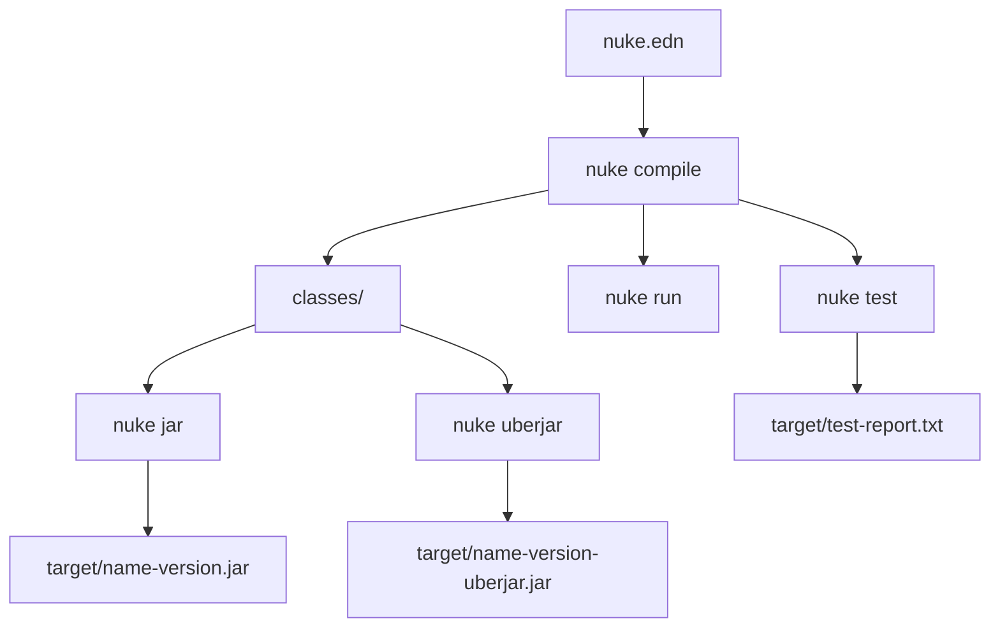
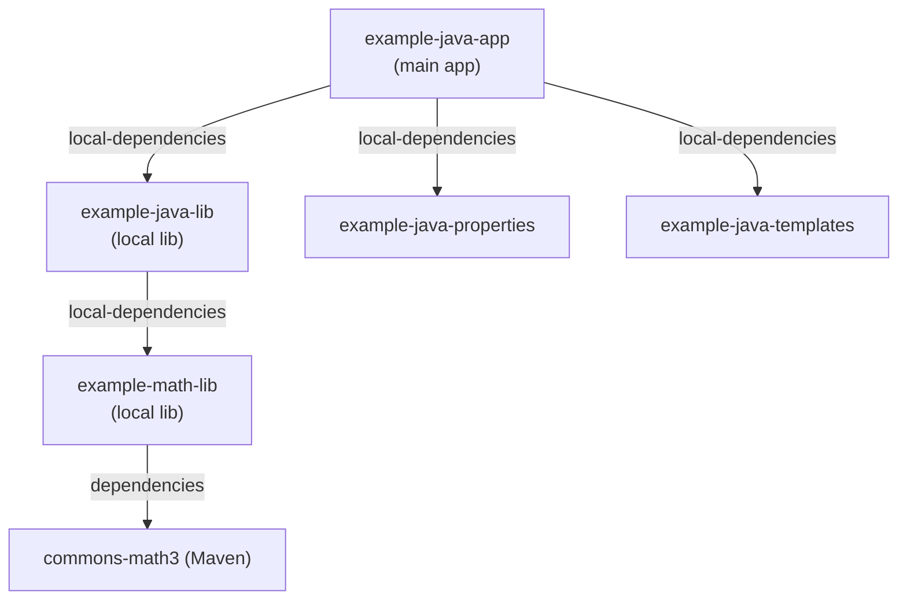
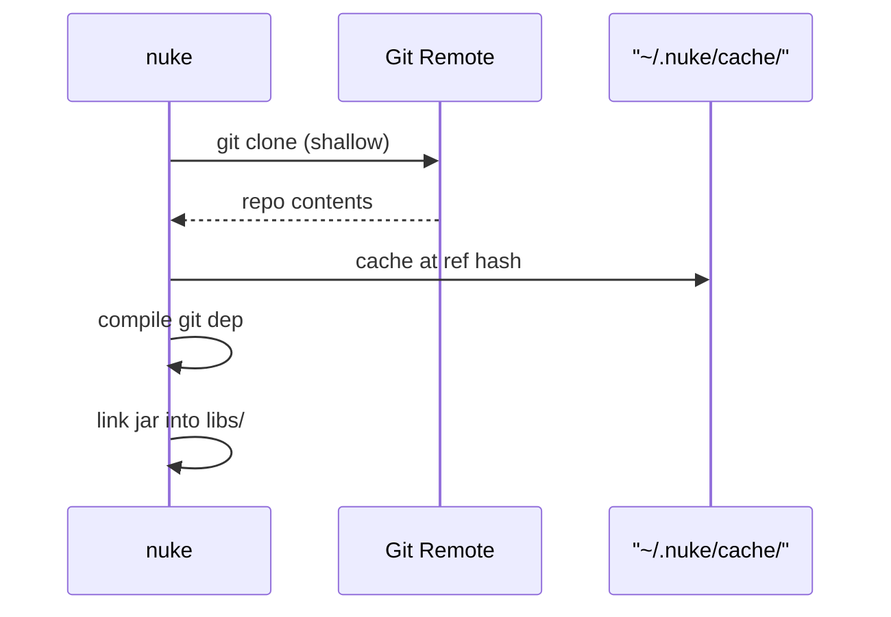
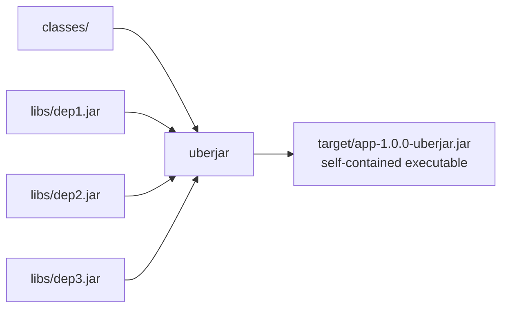
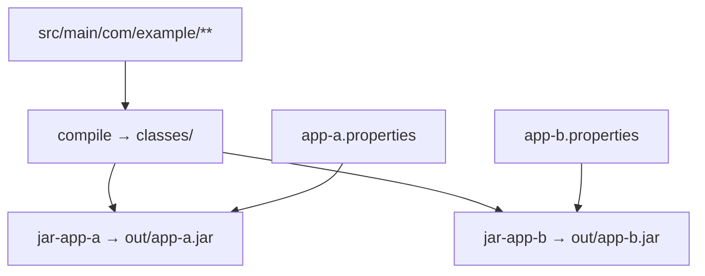
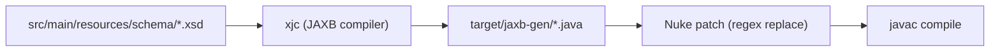
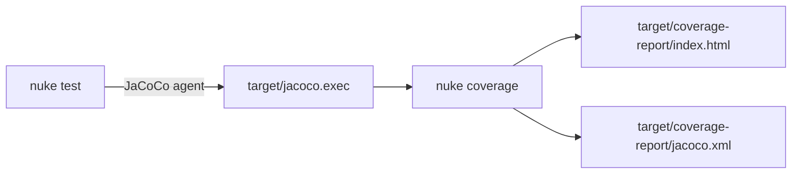
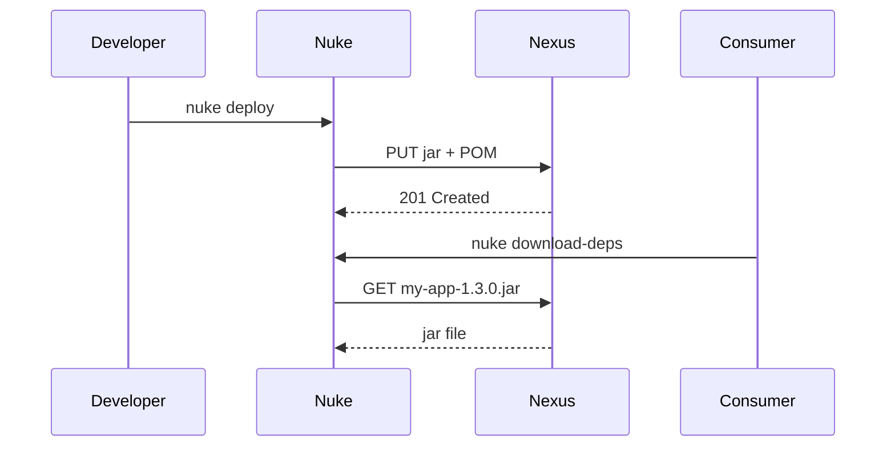
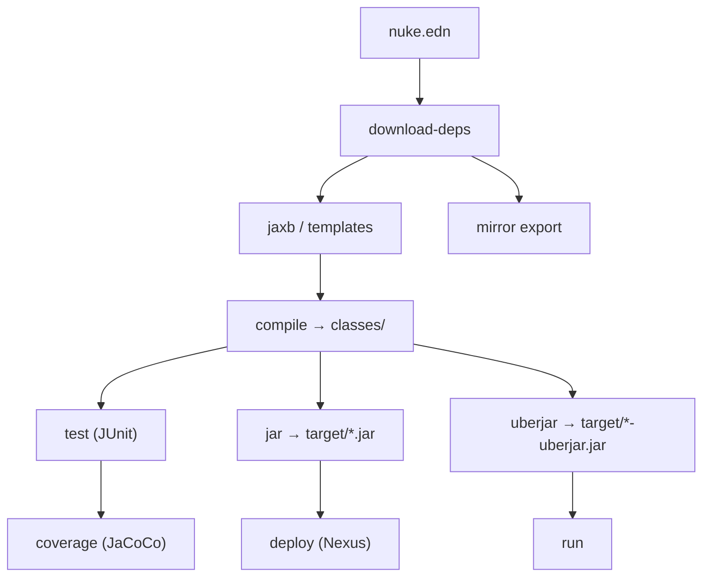

# Nuke Build Tool — Complete Tutorial

> **Nuke** is a fast, zero-dependency Java build tool. It replaces Maven, Gradle, and Ant with a simple EDN configuration file and a single native binary that runs on macOS, Linux, and Windows.

---

## Table of Contents

1. [Quick Start](#1-quick-start)
2. [Project Structure](#2-project-structure)
3. [Core Commands](#3-core-commands)
4. [Dependencies](#4-dependencies)
5. [Local Dependencies & Multi-Module Projects](#5-local-dependencies--multi-module-projects)
6. [Git Dependencies](#6-git-dependencies)
7. [Dependency Scopes](#7-dependency-scopes)
8. [Testing with JUnit 5](#8-testing-with-junit-5)
9. [Creating Jars & Uberjars](#9-creating-jars--uberjars)
10. [Custom Tasks](#10-custom-tasks)
11. [Multiple Jars from One Source Tree](#11-multiple-jars-from-one-source-tree)
12. [Multiple Run Targets](#12-multiple-run-targets)
13. [Templates](#13-templates)
14. [JAXB Code Generation](#14-jaxb-code-generation)
15. [Code Coverage (JaCoCo)](#15-code-coverage-jacoco)
16. [Dependency Analysis](#16-dependency-analysis)
17. [Deploying to Nexus/Maven](#17-deploying-to-nexusmaven)
18. [Airgap / Offline Mirrors](#18-airgap--offline-mirrors)
19. [Zip Tasks](#19-zip-tasks)
20. [Compiler Options & Encoding](#20-compiler-options--encoding)
21. [Full nuke.edn Reference](#21-full-nukeedn-reference)

---

## 1. Quick Start

Install nuke by downloading the binary for your platform and putting it on your PATH:

```sh
# macOS
cp nuke-mac /usr/local/bin/nuke && chmod +x /usr/local/bin/nuke

# Linux
cp nuke-linux /usr/local/bin/nuke && chmod +x /usr/local/bin/nuke
```

Create a minimal project:

```sh
mkdir my-project && cd my-project
```

Create `nuke.edn`:

```edn
{:name "my-project"
 :version "1.0.0"
 :main-class "com.example.Main"}
```

Create `src/main/com/example/Main.java`:

```java
package com.example;
public class Main {
    public static void main(String[] args) {
        System.out.println("Hello from Nuke!");
    }
}
```

Then build and run:

```sh
nuke compile   # Compile Java sources
nuke run       # Run the main class
nuke jar       # Package as a jar
nuke uberjar   # Package as a fat jar with all dependencies
```

---

## 2. Project Structure

Nuke follows sensible conventions. All paths are relative to the project root where `nuke.edn` lives.

```
my-project/
├── nuke.edn                    ← build configuration
├── src/
│   ├── main/                   ← production sources (default src-dir)
│   │   └── com/example/
│   │       └── Main.java
│   └── tests/                  ← test sources (default test-dir)
│       └── com/example/
│           └── MainTest.java
├── target/                     ← output jars (auto-created)
├── classes/                    ← compiled classes (auto-created)
└── libs/                       ← downloaded/linked dependency jars
```



---

## 3. Core Commands

| Command | Description |
|---|---|
| `nuke compile` | Compile all Java source files |
| `nuke run` | Compile and run `:main-class` |
| `nuke test` | Compile and run all tests |
| `nuke jar` | Build a standard jar |
| `nuke uberjar` | Build a fat jar with all deps bundled |
| `nuke clean` | Delete all build artifacts |
| `nuke download-deps` | Download all Maven dependencies |
| `nuke classpath` | Print the compile classpath |
| `nuke dependencies` | Print the dependency tree |
| `nuke version` | Show nuke version info |

---

## 4. Dependencies

### Maven Dependencies

Declare Maven coordinates in `:dependencies`:

```edn
{:name "example-maven-project"
 :version "1.0.0"
 :repositories ["https://repo1.maven.org/maven2"]
 :dependencies ["org.apache.commons:commons-lang3:3.12.0"
                "com.google.code.gson:gson:2.10.1"]
 :main-class "com.example.Main"}
```

Each dependency is a string in `groupId:artifactId:version` format. Nuke downloads jars to `~/.m2/repository` (same as Maven), so they are shared across projects.

### Dependency Exclusions

Exclude specific transitive dependencies using the map form:

```edn
:dependencies [{:coord "org.apache.commons:commons-lang3:3.12.0"
                :exclusions ["org.apache.commons:commons-math3"]}]
```

### Custom Repositories

Add private or mirror repositories:

```edn
:repositories ["https://repo1.maven.org/maven2"
               "https://my-nexus.company.com/repository/maven-public/"]
```

### Heavy Dependencies Example

```edn
{:name "example-heavy-deps"
 :version "1.0.0"
 :dependencies ["com.fasterxml.jackson.core:jackson-databind:2.15.2"
                "org.apache.logging.log4j:log4j-core:2.20.0"
                "org.apache.commons:commons-lang3:3.12.0"
                "com.google.guava:guava:32.1.2-jre"
                "org.apache.httpcomponents.client5:httpclient5:5.2.1"]
 :main-class "com.example.Main"}
```

Nuke's incremental download cache means dependencies are only fetched once.

---

## 5. Local Dependencies & Multi-Module Projects

Use `:local-dependencies` to reference other projects on disk. Nuke automatically compiles them and links their jars.



### App nuke.edn

```edn
{:name "example-java-app"
 :version "1.0.0"
 :main-class "com.example.Main"
 :local-dependencies [{:path "../example-java-lib"}
                      {:path "../example-java-properties"}
                      {:path "../example-java-templates"}]}
```

### Library nuke.edn

```edn
{:name "example-java-lib"
 :version "1.0.0"
 :group-id "com.example"
 :javac-opts ["--release" "17"]
 :local-dependencies ["../example-math-lib"]}
```

Local deps can be strings (just the path) or maps with `{:path "..."}`. When you run `nuke uberjar` on the app, Nuke recursively compiles all local dependencies, downloads their Maven deps, links their jars, then compiles the app against all of them.

---

## 6. Git Dependencies

Reference libraries directly from a Git repository without publishing to Maven:

```edn
{:name "example-git-dep"
 :version "1.0.0"
 :git-dependencies ["https://github.com/coni-lang/nuke.git//example-math-lib#main"]
 :main-class "com.example.GitDepApp"}
```

The format is: `<git-url>//<subpath>#<ref>`

- `<git-url>` — any Git URL (HTTPS or SSH)
- `//<subpath>` — optional subdirectory inside the repo
- `#<ref>` — branch, tag, or commit hash



---

## 7. Dependency Scopes

Nuke supports `compile`, `provided`, and `test` scopes for fine-grained classpath control:

```edn
{:name "example-java-scopes"
 :version "1.0.0"
 :main-class "com.example.Main"
 :dependencies {
   :compile  ["org.apache.commons:commons-lang3:3.12.0"]
   :provided ["javax.servlet:javax.servlet-api:4.0.1"]
   :test     ["junit:junit:4.13.2"]
 }}
```

| Scope | Compile CP | Test CP | Uberjar |
|---|---|---|---|
| `:compile` | ✅ | ✅ | ✅ |
| `:provided` | ✅ | ✅ | ❌ |
| `:test` | ❌ | ✅ | ❌ |

The flat list format `["group:artifact:version"]` defaults all deps to `:compile` scope.

---

## 8. Testing with JUnit 5

Nuke has built-in support for JUnit 5 (Jupiter). Add dependencies and put tests in `src/tests/`:

```edn
{:name "example-junit5"
 :version "1.0.0"
 :dependencies ["org.junit.jupiter:junit-jupiter-api:5.9.3"
                "org.junit.jupiter:junit-jupiter-engine:5.9.3"
                "org.junit.platform:junit-platform-console:1.9.3"]
 :main-class "com.example.Calculator"}
```

Write tests using JUnit 5 annotations:

```java
import org.junit.jupiter.api.Test;
import static org.junit.jupiter.api.Assertions.assertEquals;

public class CalculatorTest {
    @Test
    public void testAdd() {
        assertEquals(5, new Calculator().add(2, 3));
    }
}
```

Run tests:

```sh
nuke test
```

Output:
```
╷
└─ JUnit Jupiter ✔
   └─ CalculatorTest ✔
      └─ testAdd() ✔

Test run finished after 20 ms
[   1 tests found      ]
[   1 tests successful ]
[   0 tests failed     ]

  ✓ All tests passed! Report saved to target/test-report.txt.
```

---

## 9. Creating Jars & Uberjars

### Standard Jar

A standard jar contains only your compiled classes:

```sh
nuke jar
# → target/my-project-1.0.0.jar
```

### Uberjar (Fat Jar)

An uberjar bundles your classes **and all dependencies** into one executable jar:

```edn
{:name "example-java-uberjar"
 :version "1.0.0"
 :dependencies ["org.apache.commons:commons-lang3:3.12.0"]
 :main-class "com.example.Main"}
```

```sh
nuke uberjar
# → target/example-java-uberjar-1.0.0-uberjar.jar

java -jar target/example-java-uberjar-1.0.0-uberjar.jar
```



---

## 10. Custom Tasks

Define custom tasks using `:tasks`. Tasks can extend built-in tasks, declare dependencies, and run arbitrary Coni expressions.

### Inline Coni Expression Task

```edn
{:name "example-java-coverage"
 :version "1.0.0"
 :tasks {
   :os {:coni "(println (sys-os-name))"}
 }}
```

Run it:
```sh
nuke os
# → linux
```

### Extending a Built-in Task

```edn
:tasks {:custom-uberjar {:extends "uberjar"
                         :deps ["compile"]
                         :jar-name "out/my-fat-app.jar"
                         :desc "Creates an uberjar with a custom name"}}
```

Run it:
```sh
nuke custom-uberjar
# → out/my-fat-app.jar
```

### Task with Dependencies

```edn
:tasks {:run-and-test {:deps ["compile" "test"]
                       :coni "(println \"Build complete!\")"}}
```


---

## 11. Multiple Jars from One Source Tree

Build different jars from the same source tree by filtering which files and resources to include:

```edn
{:name "example-java-multi-jar"
 :version "1.0.0"

 :tasks
 {:jar-app-a {:extends "jar"
              :jar-name "out/app-a.jar"
              :includes ["com/example/**" "app-a.properties"]}

  :jar-app-b {:extends "jar"
              :jar-name "out/app-b.jar"
              :includes ["com/example/**" "app-b.properties"]}}}
```

```sh
nuke jar-app-a   # → out/app-a.jar  (with app-a.properties)
nuke jar-app-b   # → out/app-b.jar  (with app-b.properties)
```



Each jar contains the same compiled classes but different configuration files — useful for deploying the same codebase to multiple environments.

---

## 12. Multiple Run Targets

Define multiple entry points in the same project:

```edn
{:name "example-java-multi-run"
 :version "1.0.0"
 :tasks {:run-a {:extends "run"
                 :deps ["compile"]
                 :main-class "com.example.a.A"
                 :desc "Runs Class A"}
         :run-b {:extends "run"
                 :deps ["compile"]
                 :main-class "com.example.b.B"
                 :desc "Runs Class B"}}}
```

```sh
nuke run-a   # Runs com.example.a.A
nuke run-b   # Runs com.example.b.B
```

---

## 13. Templates

Nuke can process template files at build time, substituting `${name}` and `${version}` with values from `nuke.edn`:

```edn
{:name "example-java-templates"
 :version "1.0.0"
 :group-id "com.example"
 :templates ["src/main/resources/config.txt.template"]}
```

**`src/main/resources/config.txt.template`:**
```
app.name=${name}
app.version=${version}
build.tool=nuke
```

After `nuke compile`, the file is generated as `src/main/resources/config.txt`:
```
app.name=example-java-templates
app.version=1.0.0
build.tool=nuke
```

Templates are processed during local dependency builds too, so library consumers get the correct version strings.

---

## 14. JAXB Code Generation

Nuke has built-in support for generating Java classes from XML Schema (XSD) using JAXB:

```edn
{:name "jaxb-test"
 :version "1.0.0"
 :dependencies ["jakarta.xml.bind:jakarta.xml.bind-api:4.0.2"]
 :jaxb {:src-dir "src/main/resources/schema"
        :out-dir "target/jaxb-gen"
        :version "4.0.5"
        :patches [{:regex "protected String name;"
                   :replacement "protected String name; // Patched by Nuke!"}]}
 :main-class "Main"}
```



The `:patches` list applies regex find/replace on the generated Java files — useful for adding annotations or correcting generated code without manual editing.

```sh
nuke jar    # Generates JAXB classes, applies patches, compiles, packages
```

---

## 15. Code Coverage (JaCoCo)

Enable JaCoCo coverage reporting by adding it to the `:analysis` config:

```edn
{:name "example-java-coverage"
 :version "1.0.0"
 :dependencies ["junit:junit:4.13.2"]
 :analysis {:jacoco {:version "0.8.12"}
            :error-prone {:enabled true}}}
```

```sh
nuke test          # Run tests with JaCoCo agent attached
nuke coverage      # Generate HTML/XML coverage reports
```



---

## 16. Dependency Analysis

Nuke can analyze which jars your code actually uses at compile time:

```sh
nuke analyze-deps           # Interactive CLI report
nuke analyze-deps html      # Generate target/deps-report.html
```

The HTML report shows:
- **Used jars** — jars that loaded classes during compilation (with Java version and date)
- **Unused jars** — jars on the classpath but never loaded (candidates for removal)
- **Origin** — which Maven repository each jar came from

```sh
nuke dependencies           # Print full dependency tree
```

Example output:
```
Dependencies for example-java-app:
  - [local] ../example-java-lib
    - [local] ../example-math-lib
      - [maven] org.apache.commons:commons-math3:3.6.1
  - [local] ../example-java-properties
  - [local] ../example-java-templates
```

---

## 17. Deploying to Nexus/Maven

### Configuring Deploy

```edn
{:name "my-app"
 :version "1.3.1"
 :group-id "home.klabs"
 :main-class "home.klabs.Main"
 :deploy "http://nexus.klabs.home/repository/maven-releases/"
 :deploy-repo "hellonico"}
```

Credentials are read from `~/.m2/settings.xml` or environment variables:

```sh
export NUKE_DEPLOY_USER=myuser
export NUKE_DEPLOY_PASSWORD=mypassword
nuke deploy
```

### Consuming from Nexus

```edn
{:name "example-java-consumer"
 :version "1.0.0"
 :repositories ["http://nexus.klabs.home/repository/maven-releases/"]
 :dependencies ["home.klabs:my-app:1.3.0"]
 :main-class "home.klabs.consumer.App"}
```



---

## 18. Airgap / Offline Mirrors

Nuke supports creating offline mirrors of all dependencies for environments without internet access.

### Create a Mirror

```sh
nuke mirror export ./nuke-mirror        # export to a directory
nuke mirror export nuke-mirror.zip      # export to a zip file
```

This downloads all project dependencies **plus Nuke's built-in tool jars** (JUnit, JaCoCo, PMD, Checkstyle, JAXB) into a directory structured like `~/.m2/repository`.

### Import a Mirror

On the air-gapped machine (after transferring the zip):

```sh
nuke mirror import nuke-mirror.zip
```

This copies all jars into `~/.m2/repository`. All subsequent nuke commands work offline.

### Upload to Nexus

```sh
nuke mirror upload ./nuke-mirror
```


---

## 19. Zip Tasks

Create zip archives from project files using the built-in `zip` task:

```edn
{:name "zip-tasks-example"
 :version "1.0.0"

 :tasks
 {:zip-scripts {:extends "zip"
                :zip-includes ["scripts"]
                :desc "Zips only the scripts directory"}

  :zip-src {:extends "zip"
            :zip-includes ["src" "README.md"]
            :desc "Zips the source code and README"}

  :zip-custom-dest {:extends "zip"
                    :zip-includes ["scripts" "src"]
                    :zip-name "out/custom-archive-name.zip"
                    :desc "Zips both with a custom output name"}}}
```

```sh
nuke zip-scripts       # → target/zip-tasks-example-1.0.0.zip
nuke zip-src           # → target/zip-tasks-example-1.0.0.zip
nuke zip-custom-dest   # → out/custom-archive-name.zip
```

---

## 20. Compiler Options & Encoding

```edn
{:name "example-java-utf8"
 :version "1.0.0"
 :main-class "com.example.Main"
 :encoding "UTF-8"

 ;; Optional: pin to a specific JDK
 ;; :java-home "/Library/Java/JavaVirtualMachines/zulu-17.jdk/Contents/Home"

 :javac-opts ["-Xlint:unchecked"
              "-Xlint:deprecation"
              "--release" "17"
              "-parameters"]}
```

| Option | Purpose |
|---|---|
| `--release 17` | Target Java 17 bytecode |
| `-Xlint:unchecked` | Warn about unchecked operations |
| `-Xlint:deprecation` | Warn about deprecated API usage |
| `-parameters` | Preserve method parameter names |
| `-g` | Include debug information |

---

## 21. Full nuke.edn Reference

```edn
{;; ── Identity ──────────────────────────────────────────────────────────────
 :name        "my-project"
 :version     "1.0.0"
 :group-id    "com.example"

 ;; ── Java ──────────────────────────────────────────────────────────────────
 :main-class  "com.example.Main"
 :src-dir     "src/main"
 :src-dirs    ["src/main/java"]
 :test-dir    "src/tests"
 :test-dirs   ["src/test/java"]
 :encoding    "UTF-8"
 :java-home   "/path/to/jdk"
 :javac-opts  ["--release" "17"]

 ;; ── Dependencies ──────────────────────────────────────────────────────────
 :repositories ["https://repo1.maven.org/maven2"]

 :dependencies ["group:artifact:version"
                {:coord "group:artifact:version"
                 :exclusions ["group2:artifact2"]}]

 ;; or scoped:
 :dependencies {:compile  ["group:artifact:version"]
                :provided ["group:artifact:version"]
                :test     ["group:artifact:version"]}

 :test-dependencies ["group:artifact:version"]

 :local-dependencies ["../my-lib"
                       {:path "../other-lib"}]

 :git-dependencies ["https://github.com/org/repo.git//subdir#main"]

 ;; ── Output ────────────────────────────────────────────────────────────────
 :jar-name    "out/custom-name.jar"

 ;; ── Templates ─────────────────────────────────────────────────────────────
 :templates ["src/main/resources/app.properties.template"]

 ;; ── JAXB ──────────────────────────────────────────────────────────────────
 :jaxb {:src-dir "src/main/resources/schema"
        :out-dir "target/jaxb-gen"
        :version "4.0.5"
        :patches [{:regex "old text" :replacement "new text"}]}

 ;; ── Analysis ──────────────────────────────────────────────────────────────
 :analysis {:jacoco      {:version "0.8.12"}
            :error-prone {:enabled true}
            :pmd         {:version "7.0.0"}
            :checkstyle  {:version "10.15.0"}}

 ;; ── Deploy ────────────────────────────────────────────────────────────────
 :deploy      "https://nexus.company.com/repository/maven-releases/"
 :deploy-repo "my-nexus"

 ;; ── Clean ─────────────────────────────────────────────────────────────────
 :clean ["classes" "target" "libs" ".nuke-tmp"]

 ;; ── Custom Tasks ──────────────────────────────────────────────────────────
 :tasks {
   :print-os    {:coni "(println (sys-os-name))"
                 :desc "Print operating system"}

   :fat-jar     {:extends "uberjar"
                 :deps    ["compile"]
                 :jar-name "out/my-fat-app.jar"
                 :desc    "Build fat jar"}

   :jar-prod    {:extends  "jar"
                 :jar-name "out/prod.jar"
                 :includes ["com/example/**" "prod.properties"]}

   :run-server  {:extends    "run"
                 :deps       ["compile"]
                 :main-class "com.example.Server"
                 :desc       "Start the HTTP server"}

   :zip-release {:extends      "zip"
                 :zip-includes ["src" "README.md"]
                 :zip-name     "out/release.zip"}
 }}
```

---

## Build Lifecycle Overview



---

*Generated for Nuke Build Tool v1.3.0*
