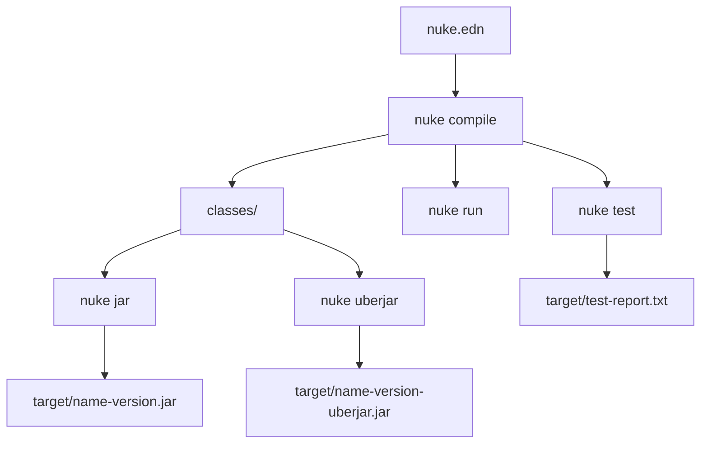
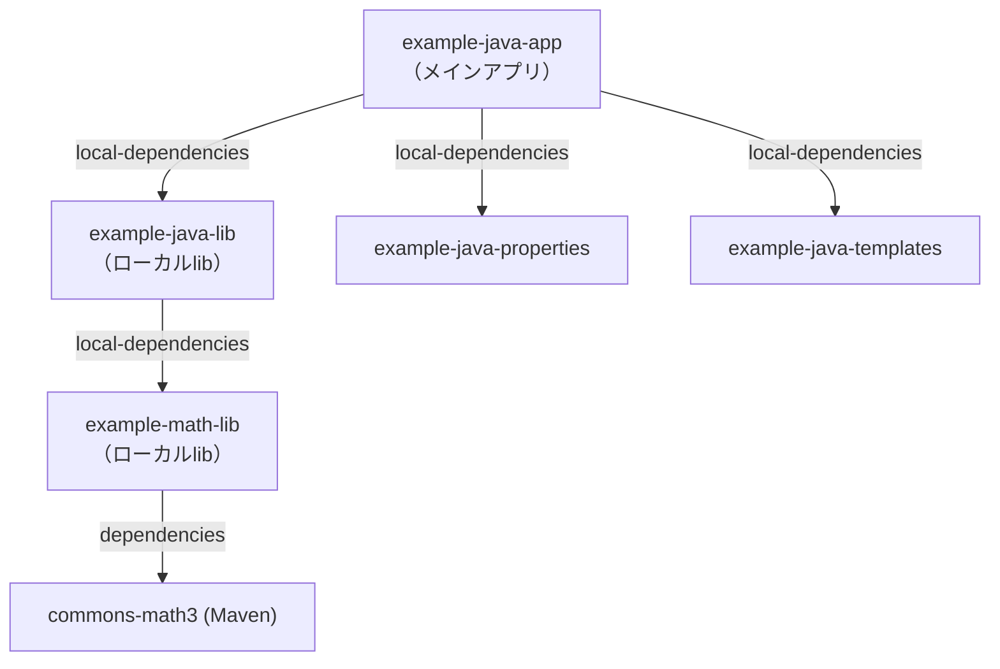
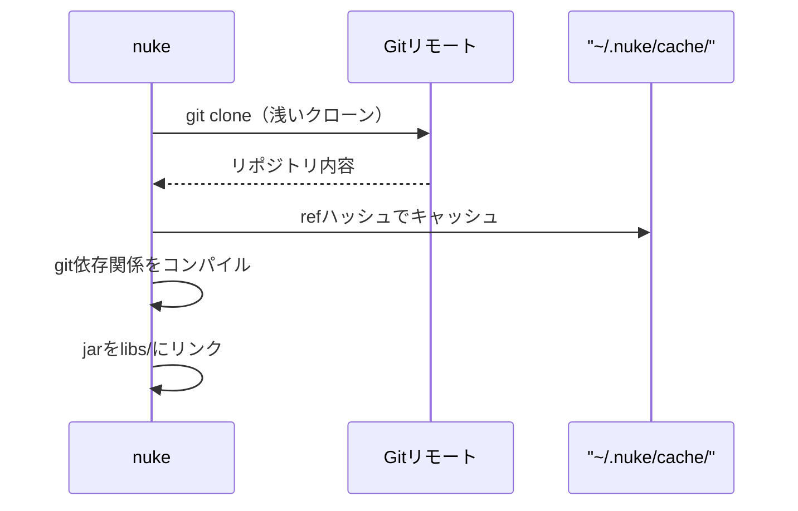
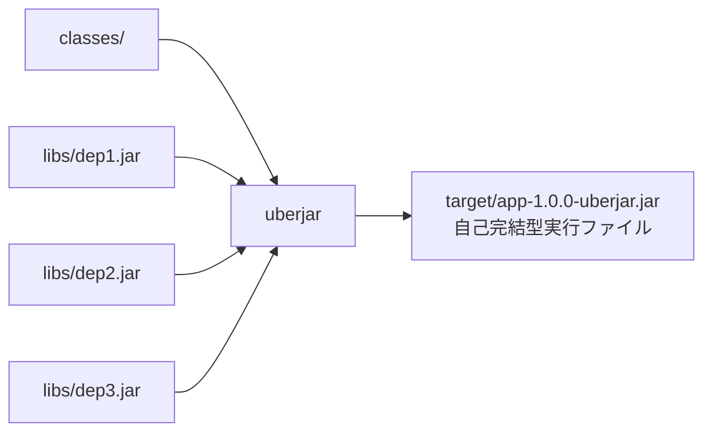
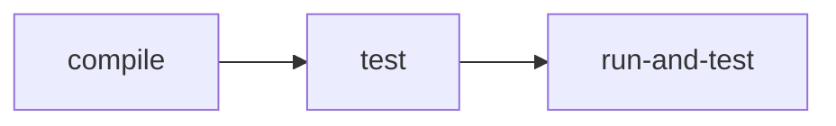
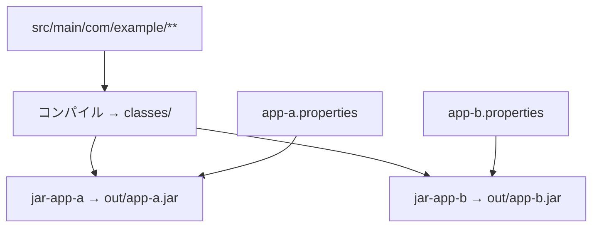
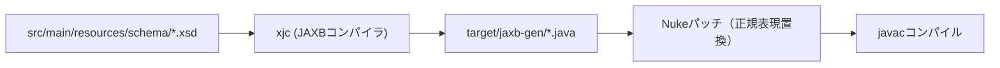
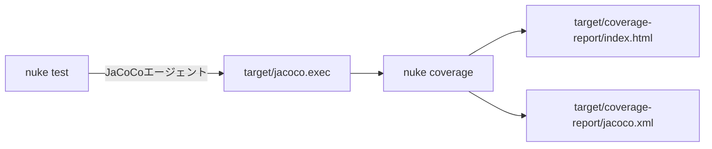
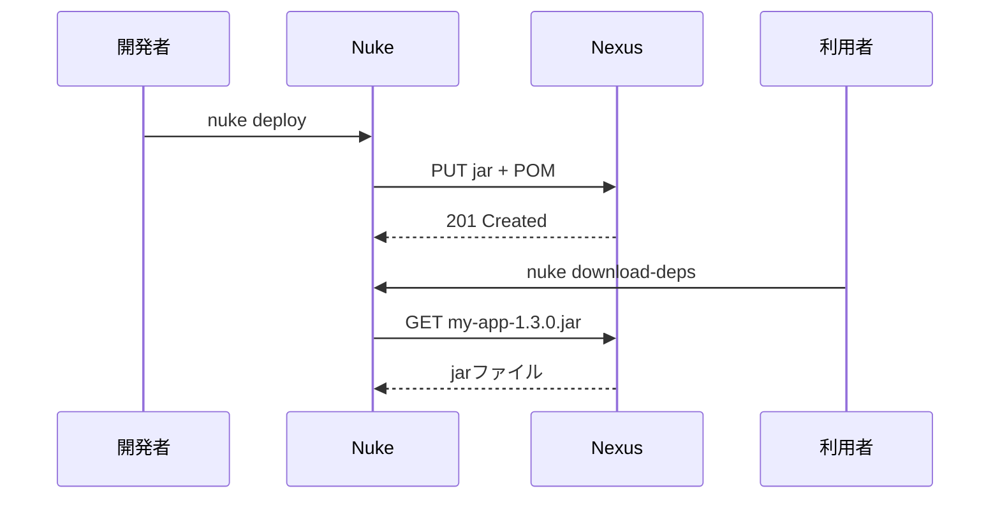
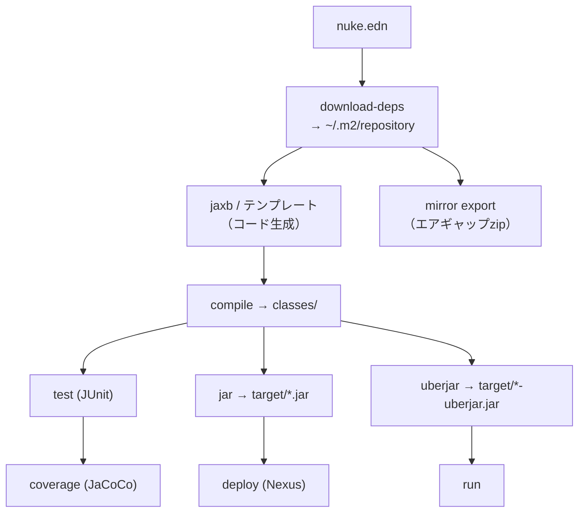

# Nuke ビルドツール — 完全チュートリアル

> **Nuke** は高速でゼロ依存のJavaビルドツールです。Maven、Gradle、AntをシンプルなEDN設定ファイルと単一のネイティブバイナリで置き換えます。macOS、Linux、Windowsで動作します。

---

## 目次

1. [クイックスタート](#1-クイックスタート)
2. [プロジェクト構造](#2-プロジェクト構造)
3. [コアコマンド](#3-コアコマンド)
4. [依存関係](#4-依存関係)
5. [ローカル依存関係とマルチモジュールプロジェクト](#5-ローカル依存関係とマルチモジュールプロジェクト)
6. [Git依存関係](#6-git依存関係)
7. [依存関係スコープ](#7-依存関係スコープ)
8. [JUnit 5によるテスト](#8-junit-5によるテスト)
9. [Jar・Uberjarの作成](#9-jaruberjarの作成)
10. [カスタムタスク](#10-カスタムタスク)
11. [1つのソースツリーから複数のJar](#11-1つのソースツリーから複数のjar)
12. [複数の実行ターゲット](#12-複数の実行ターゲット)
13. [テンプレート](#13-テンプレート)
14. [JAXBコード生成](#14-jaxbコード生成)
15. [コードカバレッジ（JaCoCo）](#15-コードカバレッジjacoco)
16. [依存関係分析](#16-依存関係分析)
17. [Nexus/Mavenへのデプロイ](#17-nexusmavenへのデプロイ)
18. [エアギャップ / オフラインミラー](#18-エアギャップ--オフラインミラー)
19. [Zipタスク](#19-zipタスク)
20. [コンパイラオプションとエンコーディング](#20-コンパイラオプションとエンコーディング)
21. [nuke.edn 完全リファレンス](#21-nukeedn-完全リファレンス)

---

## 1. クイックスタート

プラットフォームに合わせてバイナリをダウンロードし、PATHに追加します：

```sh
# macOS
cp nuke-mac /usr/local/bin/nuke && chmod +x /usr/local/bin/nuke

# Linux
cp nuke-linux /usr/local/bin/nuke && chmod +x /usr/local/bin/nuke
```

最小プロジェクトを作成します：

```sh
mkdir my-project && cd my-project
```

`nuke.edn` を作成：

```edn
{:name "my-project"
 :version "1.0.0"
 :main-class "com.example.Main"}
```

`src/main/com/example/Main.java` を作成：

```java
package com.example;
public class Main {
    public static void main(String[] args) {
        System.out.println("Hello from Nuke!");
    }
}
```

ビルドと実行：

```sh
nuke compile   # Javaソースをコンパイル
nuke run       # メインクラスを実行
nuke jar       # jarとしてパッケージ
nuke uberjar   # 全依存関係を含むfat jarとしてパッケージ
```

---

## 2. プロジェクト構造

Nukeは合理的な規約に従います。すべてのパスは `nuke.edn` が存在するプロジェクトルートからの相対パスです。

```
my-project/
├── nuke.edn                    ← ビルド設定
├── src/
│   ├── main/                   ← 本番ソース（デフォルトのsrc-dir）
│   │   └── com/example/
│   │       └── Main.java
│   └── tests/                  ← テストソース（デフォルトのtest-dir）
│       └── com/example/
│           └── MainTest.java
├── target/                     ← 出力jar（自動作成）
├── classes/                    ← コンパイル済みクラス（自動作成）
└── libs/                       ← ダウンロード/リンクされた依存jar
```



---

## 3. コアコマンド

| コマンド | 説明 |
|---|---|
| `nuke compile` | 全Javaソースファイルをコンパイル |
| `nuke run` | コンパイルして `:main-class` を実行 |
| `nuke test` | コンパイルして全テストを実行 |
| `nuke jar` | 標準jarをビルド |
| `nuke uberjar` | 全依存関係を含むfat jarをビルド |
| `nuke clean` | 全ビルド成果物を削除 |
| `nuke download-deps` | 全Maven依存関係をダウンロード |
| `nuke classpath` | コンパイルクラスパスを表示 |
| `nuke dependencies` | 依存関係ツリーを表示 |
| `nuke version` | nukeバージョン情報を表示 |

---

## 4. 依存関係

### Maven依存関係

`:dependencies` にMaven座標を宣言します：

```edn
{:name "example-maven-project"
 :version "1.0.0"
 :repositories ["https://repo1.maven.org/maven2"]
 :dependencies ["org.apache.commons:commons-lang3:3.12.0"
                "com.google.code.gson:gson:2.10.1"]
 :main-class "com.example.Main"}
```

各依存関係は `groupId:artifactId:version` 形式の文字列です。Nukeはjarを `~/.m2/repository`（Mavenと同じ）にダウンロードするため、プロジェクト間で共有されます。

### 依存関係の除外

マップ形式を使用して特定のトランザクティブ依存関係を除外します：

```edn
:dependencies [{:coord "org.apache.commons:commons-lang3:3.12.0"
                :exclusions ["org.apache.commons:commons-math3"]}]
```

### カスタムリポジトリ

プライベートまたはミラーリポジトリを追加します：

```edn
:repositories ["https://repo1.maven.org/maven2"
               "https://my-nexus.company.com/repository/maven-public/"]
```

### 大量依存関係の例

```edn
{:name "example-heavy-deps"
 :version "1.0.0"
 :dependencies ["com.fasterxml.jackson.core:jackson-databind:2.15.2"
                "org.apache.logging.log4j:log4j-core:2.20.0"
                "org.apache.commons:commons-lang3:3.12.0"
                "com.google.guava:guava:32.1.2-jre"
                "org.apache.httpcomponents.client5:httpclient5:5.2.1"]
 :main-class "com.example.Main"}
```

Nukeのインクリメンタルダウンロードキャッシュにより、依存関係は一度だけ取得されます。

---

## 5. ローカル依存関係とマルチモジュールプロジェクト

`:local-dependencies` を使用してディスク上の他のプロジェクトを参照します。Nukeは自動的にそれらをコンパイルしてjarをリンクします。



### アプリの nuke.edn

```edn
{:name "example-java-app"
 :version "1.0.0"
 :main-class "com.example.Main"
 :local-dependencies [{:path "../example-java-lib"}
                      {:path "../example-java-properties"}
                      {:path "../example-java-templates"}]}
```

### ライブラリの nuke.edn

```edn
{:name "example-java-lib"
 :version "1.0.0"
 :group-id "com.example"
 :javac-opts ["--release" "17"]
 :local-dependencies ["../example-math-lib"]}
```

ローカル依存関係は文字列（パスのみ）または `{:path "..."}` のマップで指定できます。アプリで `nuke uberjar` を実行すると、Nukeは全ローカル依存関係を再帰的にコンパイルし、Maven依存関係をダウンロードし、jarをリンクしてからアプリをコンパイルします。

---

## 6. Git依存関係

Mavenに公開せずにGitリポジトリから直接ライブラリを参照します：

```edn
{:name "example-git-dep"
 :version "1.0.0"
 :git-dependencies ["https://github.com/coni-lang/nuke.git//example-math-lib#main"]
 :main-class "com.example.GitDepApp"}
```

形式は：`<git-url>//<サブパス>#<ref>`

- `<git-url>` — 任意のGit URL（HTTPSまたはSSH）
- `//<サブパス>` — リポジトリ内のサブディレクトリ（省略可）
- `#<ref>` — ブランチ、タグ、またはコミットハッシュ



---

## 7. 依存関係スコープ

Nukeは `compile`、`provided`、`test` スコープをサポートしており、クラスパスを細かく制御できます：

```edn
{:name "example-java-scopes"
 :version "1.0.0"
 :main-class "com.example.Main"
 :dependencies {
   :compile  ["org.apache.commons:commons-lang3:3.12.0"]
   :provided ["javax.servlet:javax.servlet-api:4.0.1"]
   :test     ["junit:junit:4.13.2"]
 }}
```

| スコープ | コンパイルCP | テストCP | Uberjar |
|---|---|---|---|
| `:compile` | ✅ | ✅ | ✅ |
| `:provided` | ✅ | ✅ | ❌ |
| `:test` | ❌ | ✅ | ❌ |

フラットリスト形式 `["group:artifact:version"]` は全依存関係をデフォルトで `:compile` スコープにします。

---

## 8. JUnit 5によるテスト

NukeはJUnit 5（Jupiter）をネイティブサポートしています。依存関係を追加してテストを `src/tests/` に配置します：

```edn
{:name "example-junit5"
 :version "1.0.0"
 :dependencies ["org.junit.jupiter:junit-jupiter-api:5.9.3"
                "org.junit.jupiter:junit-jupiter-engine:5.9.3"
                "org.junit.platform:junit-platform-console:1.9.3"]
 :main-class "com.example.Calculator"}
```

JUnit 5アノテーションを使用してテストを記述します：

```java
import org.junit.jupiter.api.Test;
import static org.junit.jupiter.api.Assertions.assertEquals;

public class CalculatorTest {
    @Test
    public void testAdd() {
        assertEquals(5, new Calculator().add(2, 3));
    }
}
```

テストを実行：

```sh
nuke test
```

出力：
```
╷
└─ JUnit Jupiter ✔
   └─ CalculatorTest ✔
      └─ testAdd() ✔

テスト実行完了 20 ms後
[   1 テスト検出    ]
[   1 テスト成功    ]
[   0 テスト失敗    ]

  ✓ 全テスト成功！レポートはtarget/test-report.txtに保存。
```

---

## 9. Jar・Uberjarの作成

### 標準Jar

標準jarにはコンパイル済みクラスのみが含まれます：

```sh
nuke jar
# → target/my-project-1.0.0.jar
```

### Uberjar（Fat Jar）

Uberjarはクラスと**全依存関係**を1つの実行可能jarにまとめます：

```edn
{:name "example-java-uberjar"
 :version "1.0.0"
 :dependencies ["org.apache.commons:commons-lang3:3.12.0"]
 :main-class "com.example.Main"}
```

```sh
nuke uberjar
# → target/example-java-uberjar-1.0.0-uberjar.jar

java -jar target/example-java-uberjar-1.0.0-uberjar.jar
```



---

## 10. カスタムタスク

`:tasks` を使用してカスタムタスクを定義します。タスクはビルトインタスクを継承したり、依存関係を宣言したり、任意のConi式を実行できます。

### インラインConi式タスク

```edn
{:name "example-java-coverage"
 :version "1.0.0"
 :tasks {
   :os {:coni "(println (sys-os-name))"}
 }}
```

実行：
```sh
nuke os
# → linux
```

### ビルトインタスクの継承

```edn
:tasks {:custom-uberjar {:extends "uberjar"
                         :deps ["compile"]
                         :jar-name "out/my-fat-app.jar"
                         :desc "カスタム名でuberjarを作成"}}
```

実行：
```sh
nuke custom-uberjar
# → out/my-fat-app.jar
```

### 依存関係を持つタスク

```edn
:tasks {:run-and-test {:deps ["compile" "test"]
                       :coni "(println \"ビルド完了！\")"}}
```



---

## 11. 1つのソースツリーから複数のJar

同じソースツリーから、含めるファイルとリソースをフィルタリングして異なるjarをビルドします：

```edn
{:name "example-java-multi-jar"
 :version "1.0.0"

 :tasks
 {:jar-app-a {:extends "jar"
              :jar-name "out/app-a.jar"
              :includes ["com/example/**" "app-a.properties"]}

  :jar-app-b {:extends "jar"
              :jar-name "out/app-b.jar"
              :includes ["com/example/**" "app-b.properties"]}}}
```

```sh
nuke jar-app-a   # → out/app-a.jar  （app-a.propertiesを含む）
nuke jar-app-b   # → out/app-b.jar  （app-b.propertiesを含む）
```



同じコードベースを複数の環境にデプロイする場合に便利です。

---

## 12. 複数の実行ターゲット

同じプロジェクトに複数のエントリーポイントを定義します：

```edn
{:name "example-java-multi-run"
 :version "1.0.0"
 :tasks {:run-a {:extends "run"
                 :deps ["compile"]
                 :main-class "com.example.a.A"
                 :desc "クラスAを実行"}
         :run-b {:extends "run"
                 :deps ["compile"]
                 :main-class "com.example.b.B"
                 :desc "クラスBを実行"}}}
```

```sh
nuke run-a   # com.example.a.Aを実行
nuke run-b   # com.example.b.Bを実行
```

---

## 13. テンプレート

Nukeはビルド時にテンプレートファイルを処理し、`${name}` と `${version}` を `nuke.edn` の値で置換できます：

```edn
{:name "example-java-templates"
 :version "1.0.0"
 :group-id "com.example"
 :templates ["src/main/resources/config.txt.template"]}
```

**`src/main/resources/config.txt.template`：**
```
app.name=${name}
app.version=${version}
build.tool=nuke
```

`nuke compile` 後、`src/main/resources/config.txt` として生成されます：
```
app.name=example-java-templates
app.version=1.0.0
build.tool=nuke
```

テンプレートはローカル依存関係ビルド中にも処理されるため、ライブラリの利用者は正しいバージョン文字列を取得できます。

---

## 14. JAXBコード生成

NukeはJAXBを使用してXMLスキーマ（XSD）からJavaクラスを生成するビルトインサポートを備えています：

```edn
{:name "jaxb-test"
 :version "1.0.0"
 :dependencies ["jakarta.xml.bind:jakarta.xml.bind-api:4.0.2"]
 :jaxb {:src-dir "src/main/resources/schema"
        :out-dir "target/jaxb-gen"
        :version "4.0.5"
        :patches [{:regex "protected String name;"
                   :replacement "protected String name; // Nukeによってパッチ済み！"}]}
 :main-class "Main"}
```



`:patches` リストは生成されたJavaファイルに正規表現による検索・置換を適用します。手動編集なしにアノテーションを追加したり生成コードを修正するのに便利です。

```sh
nuke jar    # JAXBクラスを生成、パッチを適用、コンパイル、パッケージ
```

---

## 15. コードカバレッジ（JaCoCo）

`:analysis` 設定にJaCoCoを追加してカバレッジレポートを有効にします：

```edn
{:name "example-java-coverage"
 :version "1.0.0"
 :dependencies ["junit:junit:4.13.2"]
 :analysis {:jacoco {:version "0.8.12"}
            :error-prone {:enabled true}}}
```

```sh
nuke test          # JaCoCoエージェントをアタッチしてテストを実行
nuke coverage      # HTML/XMLカバレッジレポートを生成
```



---

## 16. 依存関係分析

Nukeはコンパイル時にコードが実際に使用するjarを分析できます：

```sh
nuke analyze-deps           # インタラクティブなCLIレポート
nuke analyze-deps html      # target/deps-report.htmlを生成
```

HTMLレポートには以下が表示されます：
- **使用中のjar** — コンパイル中にクラスをロードしたjar（Javaバージョンと日付付き）
- **未使用のjar** — クラスパスにあるが一度もロードされなかったjar（削除候補）
- **オリジン** — 各jarがどのMavenリポジトリから来たか

```sh
nuke dependencies           # 完全な依存関係ツリーを表示
```

出力例：
```
Dependencies for example-java-app:
  - [local] ../example-java-lib
    - [local] ../example-math-lib
      - [maven] org.apache.commons:commons-math3:3.6.1
  - [local] ../example-java-properties
  - [local] ../example-java-templates
```

---

## 17. Nexus/Mavenへのデプロイ

### デプロイ設定

```edn
{:name "my-app"
 :version "1.3.1"
 :group-id "home.klabs"
 :main-class "home.klabs.Main"
 :deploy "http://nexus.klabs.home/repository/maven-releases/"
 :deploy-repo "hellonico"}
```

認証情報は `~/.m2/settings.xml` または環境変数から読み取られます：

```sh
export NUKE_DEPLOY_USER=myuser
export NUKE_DEPLOY_PASSWORD=mypassword
nuke deploy
```

### Nexusからの利用

```edn
{:name "example-java-consumer"
 :version "1.0.0"
 :repositories ["http://nexus.klabs.home/repository/maven-releases/"]
 :dependencies ["home.klabs:my-app:1.3.0"]
 :main-class "home.klabs.consumer.App"}
```



---

## 18. エアギャップ / オフラインミラー

Nukeはインターネットにアクセスできない環境向けに、全依存関係のオフラインミラーを作成できます。

### ミラーの作成

```sh
nuke mirror export ./nuke-mirror        # ディレクトリにエクスポート
nuke mirror export nuke-mirror.zip      # zipファイルにエクスポート
```

これによりプロジェクトの依存関係に加え、**Nukeのビルトインツールjar**（JUnit、JaCoCo、PMD、Checkstyle、JAXB）が `~/.m2/repository` と同じ構造のディレクトリにダウンロードされます。

### ミラーのインポート

エアギャップマシンで（zipを転送後）：

```sh
nuke mirror import nuke-mirror.zip
```

全jarが `~/.m2/repository` にコピーされます。以降のnukeコマンドはオフラインで動作します。

### Nexusへのアップロード

```sh
nuke mirror upload ./nuke-mirror
```


---

## 19. Zipタスク

ビルトインの `zip` タスクを使用してプロジェクトファイルからzipアーカイブを作成します：

```edn
{:name "zip-tasks-example"
 :version "1.0.0"

 :tasks
 {:zip-scripts {:extends "zip"
                :zip-includes ["scripts"]
                :desc "scriptsディレクトリのみをzip"}

  :zip-src {:extends "zip"
            :zip-includes ["src" "README.md"]
            :desc "ソースコードとREADMEをzip"}

  :zip-custom-dest {:extends "zip"
                    :zip-includes ["scripts" "src"]
                    :zip-name "out/custom-archive-name.zip"
                    :desc "両方をzipしてカスタムファイル名で出力"}}}
```

```sh
nuke zip-scripts       # → target/zip-tasks-example-1.0.0.zip
nuke zip-src           # → target/zip-tasks-example-1.0.0.zip
nuke zip-custom-dest   # → out/custom-archive-name.zip
```

---

## 20. コンパイラオプションとエンコーディング

```edn
{:name "example-java-utf8"
 :version "1.0.0"
 :main-class "com.example.Main"
 :encoding "UTF-8"

 ;; オプション：特定のJDKを指定
 ;; :java-home "/Library/Java/JavaVirtualMachines/zulu-17.jdk/Contents/Home"

 :javac-opts ["-Xlint:unchecked"
              "-Xlint:deprecation"
              "--release" "17"
              "-parameters"]}
```

| オプション | 目的 |
|---|---|
| `--release 17` | Java 17バイトコードをターゲット |
| `-Xlint:unchecked` | 未チェック操作について警告 |
| `-Xlint:deprecation` | 非推奨API使用について警告 |
| `-parameters` | メソッドパラメータ名を保持 |
| `-g` | デバッグ情報を含める |

---

## 21. nuke.edn 完全リファレンス

```edn
{;; ── 識別情報 ──────────────────────────────────────────────────────────────
 :name        "my-project"          ; プロジェクト名（jarファイル名に使用）
 :version     "1.0.0"              ; プロジェクトバージョン
 :group-id    "com.example"        ; デプロイ用MavenグループID

 ;; ── Java ──────────────────────────────────────────────────────────────────
 :main-class  "com.example.Main"   ; run/uberjarのエントリーポイント
 :src-dir     "src/main"           ; ソースディレクトリ
 :src-dirs    ["src/main/java"]    ; 複数のソースディレクトリ
 :test-dir    "src/tests"          ; テストソースディレクトリ
 :test-dirs   ["src/test/java"]    ; 複数のテストディレクトリ
 :encoding    "UTF-8"              ; ソースファイルエンコーディング
 :java-home   "/path/to/jdk"       ; 特定のJDKを使用
 :javac-opts  ["--release" "17"]   ; 追加のjavacフラグ

 ;; ── 依存関係 ──────────────────────────────────────────────────────────────
 :repositories ["https://repo1.maven.org/maven2"]  ; Mavenリポジトリ

 ; フラットリスト（全てcompileスコープ）：
 :dependencies ["group:artifact:version"
                {:coord "group:artifact:version"
                 :exclusions ["group2:artifact2"]}]

 ; スコープマップ：
 :dependencies {:compile  ["group:artifact:version"]
                :provided ["group:artifact:version"]
                :test     ["group:artifact:version"]}

 :test-dependencies ["group:artifact:version"]    ; testスコープの省略形

 ; ディスク上のローカルプロジェクト：
 :local-dependencies ["../my-lib"
                       {:path "../other-lib"}]

 ; Gitリポジトリ：
 :git-dependencies ["https://github.com/org/repo.git//subdir#main"]

 ;; ── 出力 ──────────────────────────────────────────────────────────────────
 :jar-name    "out/custom-name.jar"       ; デフォルトのjar名を上書き

 ;; ── テンプレート ──────────────────────────────────────────────────────────
 :templates ["src/main/resources/app.properties.template"]

 ;; ── JAXB ──────────────────────────────────────────────────────────────────
 :jaxb {:src-dir "src/main/resources/schema"
        :out-dir "target/jaxb-gen"
        :version "4.0.5"
        :patches [{:regex "旧テキスト" :replacement "新テキスト"}]}

 ;; ── 分析 ──────────────────────────────────────────────────────────────────
 :analysis {:jacoco      {:version "0.8.12"}
            :error-prone {:enabled true}
            :pmd         {:version "7.0.0"}
            :checkstyle  {:version "10.15.0"}}

 ;; ── デプロイ ──────────────────────────────────────────────────────────────
 :deploy      "https://nexus.company.com/repository/maven-releases/"
 :deploy-repo "my-nexus"   ; ~/.m2/settings.xmlのサーバーIDと一致

 ;; ── クリーン ──────────────────────────────────────────────────────────────
 :clean ["classes" "target" "libs" ".nuke-tmp"]

 ;; ── カスタムタスク ────────────────────────────────────────────────────────
 :tasks {
   ; シンプルなConi式：
   :print-os    {:coni "(println (sys-os-name))"
                 :desc "OSを表示"}

   ; ビルトインタスクの継承：
   :fat-jar     {:extends "uberjar"
                 :deps    ["compile"]
                 :jar-name "out/my-fat-app.jar"
                 :desc    "fat jarをビルド"}

   ; ファイルフィルター付きカスタムjar：
   :jar-prod    {:extends  "jar"
                 :jar-name "out/prod.jar"
                 :includes ["com/example/**" "prod.properties"]}

   ; 特定のメインクラスでの実行：
   :run-server  {:extends    "run"
                 :deps       ["compile"]
                 :main-class "com.example.Server"
                 :desc       "HTTPサーバーを起動"}

   ; カスタムzip：
   :zip-release {:extends      "zip"
                 :zip-includes ["src" "README.md"]
                 :zip-name     "out/release.zip"}
 }}
```

---

## ビルドライフサイクル全体像



---

*Nuke Build Tool v1.3.0 向けに生成*
